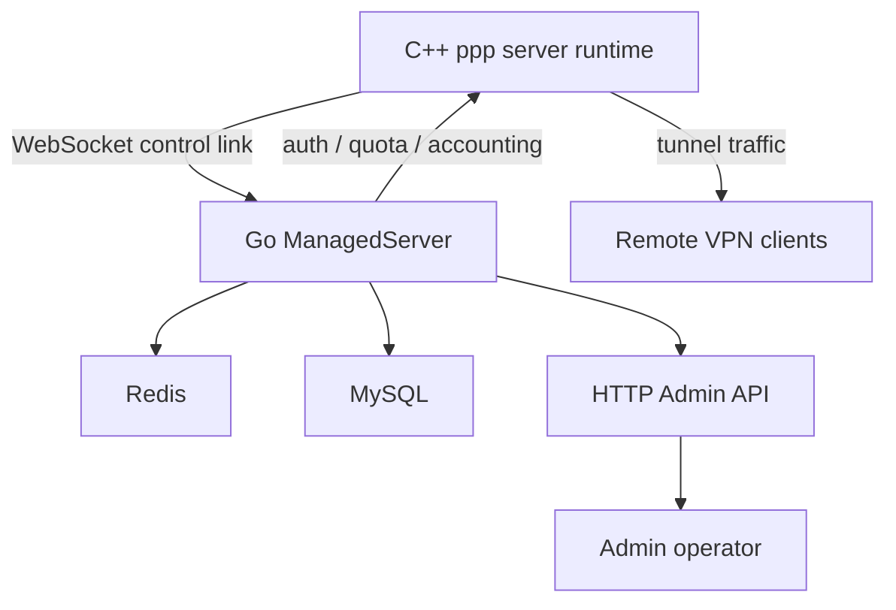
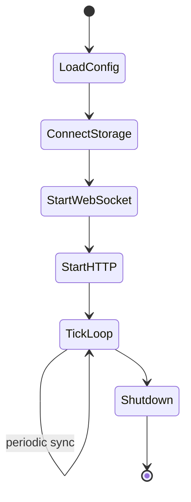
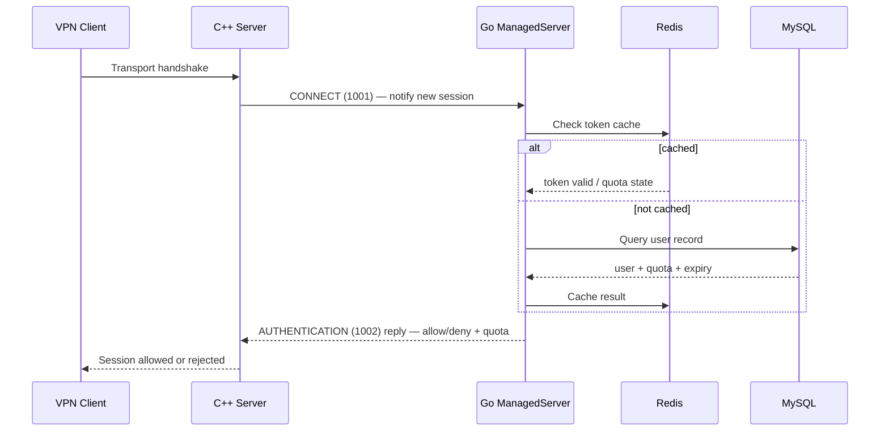
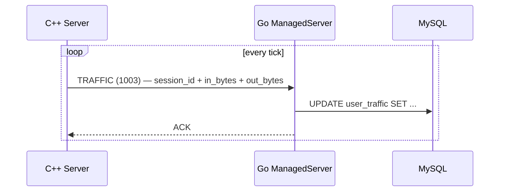
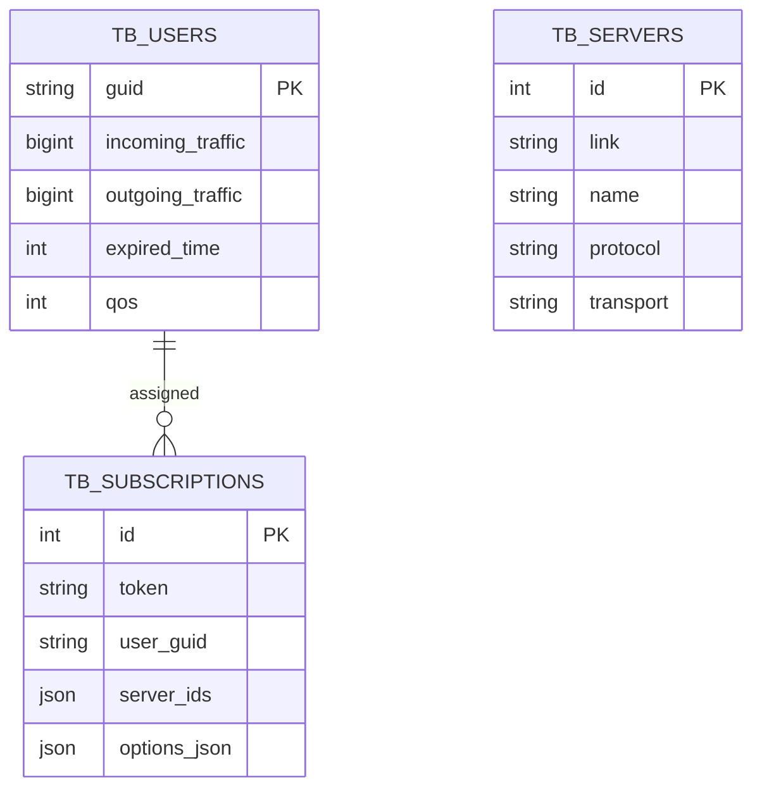

# Management Backend
> Status: Active
> Type: Guide
> Last verified: 63fc030

> **Purpose:** Describe the current behavior, configuration, or implementation boundary for this topic.
> **Audience:** OPENPPP2 users, operators, and developers.
> **Status:** Current.
> **Last verified against:** Current repository structure, implementation paths, and documentation links, 2026-07-18.
> **Parent index:** [Back to index](README.md) · **Chinese:** [管理后端](MANAGEMENT_BACKEND_CN.md)


[中文版本](MANAGEMENT_BACKEND_CN.md)

## Role

The Go service under `go/` is the management and persistence side of OPENPPP2, not the packet data plane.

It acts as the administrative control plane that the C++ server runtime can optionally connect to for:

- node authentication
- user lookup
- quota and expiry state
- traffic accounting
- HTTP management endpoints
- Redis and MySQL persistence

Without the Go backend, the C++ server still operates normally as a packet-forwarding overlay node.
With it, the C++ server gains centralized user management, persistent accounting, and remote administration.

The same executable also runs as a zero-dependency subscription manager. With no complete MySQL/Redis
configuration it starts the embedded console, stores node templates and subscriptions in
`manager-data.json`, and never requires C++ `ppp` to configure `server.backend`.

---

## Architecture Overview



The C++ process handles all packet forwarding and session state.
The Go process handles all business rules, persistence, and management surfaces.
They communicate over a framed JSON WebSocket link.

---

## Main Shape

The backend is built around `ManagedServer`.

It:

- loads managed configuration from OS args
- connects to Redis and MySQL
- exposes a WebSocket control link for the C++ server
- exposes HTTP admin endpoints for operators
- runs a background tick loop for state synchronization
- syncs user and server state periodically



---

## Wire Protocol

The control protocol between C++ and Go is framed with an **8-hex-digit length prefix** followed by JSON packet body.

Format:

```
[8 hex chars: length][JSON body]
```

Example frame:

```
0000003a{"Id":1,"Node":7,"Guid":"","Cmd":1001,"Data":"shared-key"}
```

### Observed Commands

| Code | Name | Direction | Purpose |
|------|------|-----------|---------|
| `1000` | ECHO | bidirectional | keepalive / latency probe |
| `1001` | CONNECT | C++ → Go | initial control link handshake |
| `1002` | AUTHENTICATION | C++ → Go | verify a connecting user |
| `1003` | TRAFFIC | C++ → Go | report session traffic accounting |

---

## Authentication Flow



---

## Traffic Accounting Flow



Traffic is reported periodically from the C++ side.
The Go backend persists this to MySQL for billing and quota enforcement.

---

## Configuration

No configuration or argument is required for subscription publishing. The executable uses standalone
defaults and persists its generated admin token, node templates, and subscriptions in
`manager-data.json`. If `appsettings.json` exists it overrides those defaults; the first positional
argument can still select another configuration file for an existing managed deployment.

MySQL and Redis are activated only when both are completely configured. Partial external-storage
configuration is rejected instead of silently changing modes. All HTTP surfaces share `prefixes`.

Key parameters:

| Field | Description |
|-------|-------------|
| `prefixes` | HTTP/WebSocket listen address, for example `:10000` |
| `path` | Native C++ control-link WebSocket path |
| `key` | Shared credential matching C++ `server.backend-key` |
| `database` | MySQL master and optional read replicas |
| `redis` | Redis Sentinel connection |
| `admin` | Admin token, console path, and public subscription base URL |
| `admin.data` | Standalone JSON data path; defaults to `manager-data.json` |

On the C++ side, the server config field is:

```json
"server": {
  "backend": "ws://127.0.0.1:20080/ppp/webhook"
}
```

The backend URL is set in `AppConfiguration::server.backend`.
See `ppp/configurations/AppConfiguration.h` for the field definition.

---

## HTTP Admin API

The Go backend exposes an HTTP management API for operators.

The legacy `/ppp/*` query-string endpoints remain available. The JSON API below uses an independent
admin token and does not reuse the C++ node credential in `key` / `server.backend-key`.

The embedded console is served from `/admin/` by default:

```json
"admin": {
  "token": "replace-with-a-random-admin-token",
  "path": "/admin/",
  "public-base-url": "https://manager.example.com"
}
```

`OPENPPP2_ADMIN_TOKEN` overrides the configured token. If neither source provides one, the process
generates and logs an ephemeral token for that run.

Implemented endpoints:

| Method | Path | Purpose |
|--------|------|---------|
| `GET` | `/api/v1/status` | User, server, online-server, and subscription counts |
| `GET/POST` | `/api/v1/users` | List or create VPN users |
| `PUT/DELETE` | `/api/v1/users/{guid}` | Update quota/expiry/QoS or delete a user |
| `GET/POST` | `/api/v1/servers` | List or create PPP server records |
| `PUT/DELETE` | `/api/v1/servers/{id}` | Update or delete a PPP server record |
| `GET/POST` | `/api/v1/subscriptions` | List or create subscriptions |
| `PUT/DELETE` | `/api/v1/subscriptions/{id}` | Update or delete a subscription |
| `POST` | `/api/v1/subscriptions/{id}/rotate-token` | Rotate the public subscription token |
| `GET` | `/api/v1/subscriptions/{id}/preview` | Preview the exact published JSON |
| `GET` | `/sub/{token}` | Public mobile subscription document |

Authentication to the admin API uses token-based HTTP headers.
The public subscription endpoint uses its unguessable URL token instead of the admin token.

A subscription binds one user GUID to one or more `tb_servers` records. Publishing injects the GUID
into `client.guid`, derives `server` and `key` from every selected server, and emits
`openppp2-subscription` v1 JSON with ETag support.

---

## Redis Usage

Redis is used as a fast cache layer for:

- user quota/expiry snapshots under `ppp:user:data:<GUID>`
- the `ppp:user:sync` dirty-user set used by traffic accounting
- short-lived concurrency locks that protect database lookups

When a cached user snapshot expires, the next authentication request falls through to MySQL.

---

## MySQL Schema (Conceptual)



---

## Go Backend Source Layout

The Go backend has two management systems under `go/`:

### Native managed backend: `go/`

```
go/
├── main.go                 # Entry point, arg parsing, ManagedServer startup
├── ppp/
│   ├── ManagedServer.go    # ManagedServer core (WebSocket control link)
│   ├── Handler.go          # Command handler dispatch
│   ├── Server.go           # HTTP admin server
│   ├── Configuration.go    # Configuration parsing
│   ├── User.go             # User model
│   ├── Node.go             # Node model
│   ├── Packet.go           # Wire protocol encoding
│   └── Traffic.go          # Traffic accounting
├── auxiliary/              # Logging, helpers
├── io/                     # WebSocket server, Redis client, DB wrappers
└── daemon/                 # Legacy daemon wrapper (superseded by guardian)
```

### Separate process manager: `go/guardian/`

```
go/guardian/
├── main.go                 # Entry point
├── guardian.go             # Core guardian logic
├── config.go               # Configuration
├── api/                    # HTTP API handlers
├── auth/                   # Authentication middleware
├── cmd/                    # CLI commands
├── instance/               # Per-instance lifecycle management
├── profile/                # Profile management
├── service/                # System service integration
├── webui.go                # WebUI embed and serve
└── webui/                  # Svelte + Vite frontend source
```

The guardian system supersedes `go/daemon/` and provides multi-instance management with a Svelte WebUI and Bubble Tea TUI.

---

## Why It Is Separate

The C++ and Go separation is a deliberate architectural decision:

| Concern | Owner |
|---------|-------|
| Packet forwarding | C++ runtime |
| Session state machine | C++ runtime |
| Cryptographic framing | C++ runtime |
| Platform TAP/TUN | C++ runtime |
| Route and DNS management | C++ runtime |
| User records | Go backend |
| Quota enforcement | Go backend |
| Traffic accounting | Go backend |
| Admin API | Go backend |
| Persistent storage | Go backend |

The C++ side is optimized for zero-copy, lock-minimal, high-throughput packet processing.
The Go side is optimized for business logic, database access, and HTTP API serving.
Mixing these concerns would degrade both.

---

## Deployment Topology

### Standalone (no backend)

```
[VPN clients] ──► [ppp server C++]
```

All sessions are accepted without authentication.
No traffic accounting. No quota enforcement.

### Managed (with backend)

```
[VPN clients] ──► [ppp server C++] ──WebSocket──► [Go ManagedServer]
                                                        │
                                                   [Redis] [MySQL]
```

Sessions authenticated per-user.
Quota enforced. Traffic persisted.

### Multi-server managed

```
[VPN clients] ──► [ppp server C++ node-1] ──┐
[VPN clients] ──► [ppp server C++ node-2] ──┤ WebSocket ──► [Go ManagedServer]
[VPN clients] ──► [ppp server C++ node-3] ──┘                    │
                                                             [Redis] [MySQL]
```

Multiple C++ nodes can connect to the same Go backend.
Session state is centralized. Quota is enforced globally across nodes.

---

## Building the Go Backend

```bash
cd go
go build -o ppp-go .
./ppp-go
```

Open `http://127.0.0.1:10000/admin/` and use the admin token printed on first startup. To enable the
native C++ managed protocol later, start with `./ppp-go ./appsettings.managed.json` after configuring
its MySQL and Redis values.

The Go backend is a completely separate process with independent build and run lifecycle.

---

## Error Handling

The JSON admin API returns HTTP status codes and a compact error object:

```json
{
  "error": "user not found"
}
```

For the WebSocket control link, replies use the same packet envelope and carry user state in `Data`:

```json
{"Id":2,"Node":7,"Guid":"...","Cmd":1002,"Data":"{...}"}
```

The C++ server reads this result and rejects the session with appropriate diagnostics.
See `ppp/app/server/VirtualEthernetManagedServer.*` for the C++ side parsing.

---

## Error Code Reference

Relevant `ppp::diagnostics::ErrorCode` values for management backend operations (from `ErrorCodes.def`):

| ErrorCode | Description |
|-----------|-------------|
| `VEthernetManagedConnectUrlEmpty` | Managed server connect URL is empty |
| `VEthernetManagedAuthNullCallback` | Authentication callback is null |
| `VEthernetManagedAuthDuplicateSession` | Duplicate auth request for same session |
| `VEthernetManagedPacketLengthOverflow` | Packet length exceeds supported range |
| `VEthernetManagedPacketJsonParseFailed` | Packet JSON parse failed |
| `VEthernetManagedVerifyUrlEmpty` | Verify-URI input is empty |
| `VEthernetManagedEndpointInputUrlEmpty` | Endpoint URL parse input is empty |
| `SessionAuthFailed` | Session authentication failed |
| `SessionQuotaExceeded` | Session quota exceeded |
| `KeepaliveTimeout` | Peer keepalive heartbeat timed out |

These are set via `SetLastErrorCode(...)` in `ppp/app/server/VirtualEthernetManagedServer.cpp` and `ppp/diagnostics/PreventReturn.cpp`.

---

## Usage Examples

### Connecting a C++ server to the Go backend

In `appsettings.json`:

```json
{
  "server": {
    "backend": "ws://127.0.0.1:20080/ppp/webhook",
    "backend-key": "shared-secret-token"
  }
}
```

Start the Go backend first with its configuration file:

```bash
./ppp-go ./appsettings.json
```

Start C++ server:

```bash
./ppp --mode=server --config=./appsettings.json
```

### Checking managed-backend status

```bash
curl -H "Authorization: Bearer <admin-token>" \
     http://localhost:10000/api/v1/status
```

---

## Operational Notes

- The Go backend must be started before the C++ server if the C++ server is configured to use it.
  If the backend is unreachable at startup, the C++ server will periodically retry connection.
- Existing tunnel sessions continue in the C++ data plane, while new managed authentication requires
  the backend control link.
- Redis and MySQL operational guidance applies only when managed mode is configured.

---

## Monitoring

`GET /api/v1/status` reports user, configured-node, online-node, and subscription counts. A native
Prometheus `/metrics` endpoint is not currently implemented.

---

## Related Documents

- [`DEPLOYMENT.md`](../operations/DEPLOYMENT.md)
- [`OPERATIONS.md`](../operations/OPERATIONS.md)
- [`SECURITY.md`](../operations/SECURITY.md)
- [`SERVER_ARCHITECTURE.md`](../architecture/SERVER_ARCHITECTURE.md)
- [`CONFIGURATION.md`](../reference/CONFIGURATION.md)
