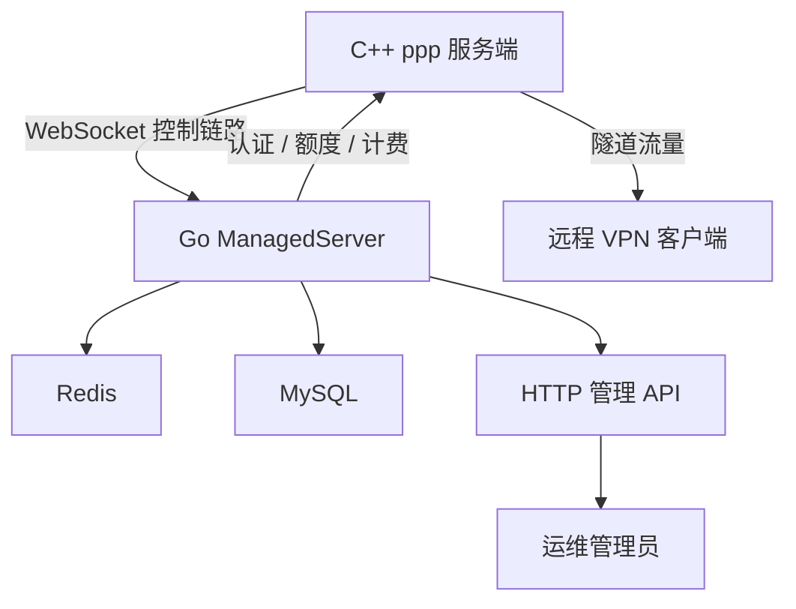
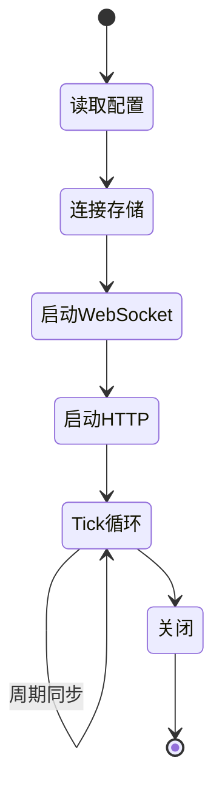
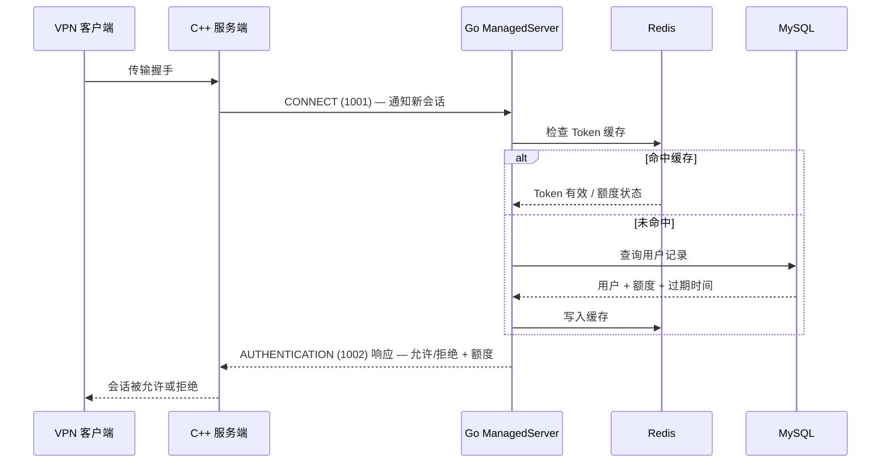
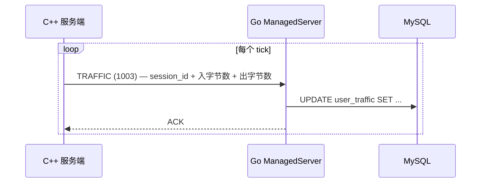
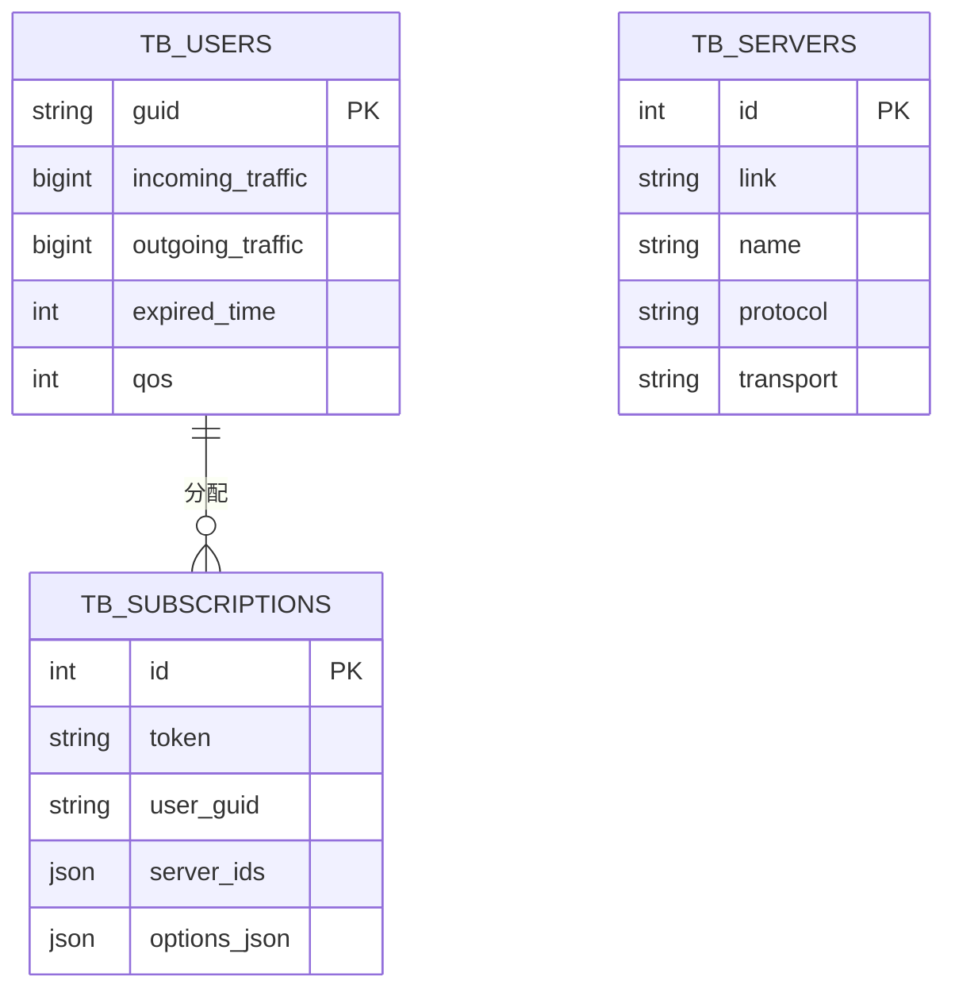

# 管理后端
> Status: Active
> Type: Guide
> Last verified: 63fc030

> **用途：**说明本主题的当前行为、配置或实现边界。
> **适用对象：**OPENPPP2 用户、运维人员与开发者。
> **当前状态：**当前有效。
> **最后核对依据：**当前仓库结构、实现路径与文档链接，2026-07-18。
> **上一层索引：**[返回索引](README_CN.md) · **English：**[Management Backend](MANAGEMENT_BACKEND.md)


[English Version](MANAGEMENT_BACKEND.md)

## 角色定位

`go/` 目录下的 Go 服务是 OPENPPP2 的管理与持久化侧，而不是分组数据面。

它作为管理控制平面，C++ 服务端运行时可以选择性地连接它，以获得：

- 节点认证
- 用户查询
- 额度与过期状态
- 流量记账
- HTTP 管理接口
- Redis 与 MySQL 持久化

没有 Go backend，C++ 服务端依然能正常运行——它继续作为一个包转发 overlay 节点工作。
有了 Go backend，C++ 服务端就具备了集中式用户管理、持久计费和远程管理能力。

同一个可执行文件也可以作为零依赖订阅管理器运行。未提供完整 MySQL/Redis 配置时，它只启动
内嵌管理页面，把订阅节点和订阅保存到 `manager-data.json`，完全不要求 C++ `ppp` 配置
`server.backend`。

---

## 架构全景



C++ 进程负责所有包转发和会话状态。
Go 进程负责所有业务规则、持久化和管理界面。
两者通过带帧 JSON 的 WebSocket 链路通信。

---

## 主要形态

后端围绕 `ManagedServer` 构建。

它会：

- 从 OS args 读取管理配置
- 连接 Redis 和 MySQL
- 为 C++ 服务端暴露 WebSocket 控制链路
- 为运维人员暴露 HTTP 管理接口
- 运行后台 tick loop 以同步状态
- 周期性地同步用户和服务端状态



---

## 线协议

C++ 与 Go 之间的控制协议以 **8 位十六进制长度前缀**加 JSON 数据包体组成。

格式：

```
[8位十六进制长度][JSON 体]
```

示例帧：

```
0000003a{"Id":1,"Node":7,"Guid":"","Cmd":1001,"Data":"shared-key"}
```

### 已观察到的命令

| 命令码 | 名称 | 方向 | 用途 |
|--------|------|------|------|
| `1000` | ECHO | 双向 | 保活 / 延迟探测 |
| `1001` | CONNECT | C++ → Go | 初始控制链路握手 |
| `1002` | AUTHENTICATION | C++ → Go | 验证接入用户 |
| `1003` | TRAFFIC | C++ → Go | 上报会话流量计费 |

---

## 认证流程



---

## 流量计费流程



流量由 C++ 侧周期性上报。
Go 后端将其持久化到 MySQL，用于计费和额度管控。

---

## 配置

订阅下发不要求配置或启动参数。程序使用独立模式默认值，并把自动生成的管理 token、订阅节点和
订阅保存到 `manager-data.json`。当前目录存在 `appsettings.json` 时会覆盖默认值；旧 Managed
部署仍可通过第一个位置参数选择其他配置文件。

只有 MySQL 和 Redis 均配置完整时才启用 Managed 能力；外部存储配置不完整会直接报错，避免
静默切换模式。所有 HTTP 接口共用 `prefixes` 监听端口。

主要参数：

| 字段 | 描述 |
|------|------|
| `prefixes` | HTTP/WebSocket 监听地址，例如 `:10000` |
| `path` | C++ 原生控制链路的 WebSocket 路径 |
| `key` | 与 C++ `server.backend-key` 一致的共享凭据 |
| `database` | MySQL 主库和可选只读副本 |
| `redis` | Redis Sentinel 连接配置 |
| `admin` | 管理 token、页面路径和公开订阅基础 URL |
| `admin.data` | 独立模式 JSON 数据路径，默认 `manager-data.json` |

C++ 侧的配置字段：

```json
"server": {
  "backend": "ws://127.0.0.1:20080/ppp/webhook"
}
```

后端 URL 写在 `AppConfiguration::server.backend` 字段中。
参见 `ppp/configurations/AppConfiguration.h`。

---

## HTTP 管理 API

Go backend 为运维人员暴露 HTTP 管理 API。

旧 `/ppp/*` 查询参数接口继续保留。下面的 JSON API 使用独立的管理 token，不复用 C++ 节点连接使用的
`key` / `server.backend-key`。

管理页面默认位于 `/admin/`：

```json
"admin": {
  "token": "replace-with-a-random-admin-token",
  "path": "/admin/",
  "public-base-url": "https://manager.example.com"
}
```

`OPENPPP2_ADMIN_TOKEN` 环境变量可以覆盖配置。两处均未提供时，进程会生成并输出一个仅本次运行有效的随机 token。

当前已实现的接口：

| 方法 | 路径 | 用途 |
|------|------|------|
| `GET` | `/api/v1/status` | 用户、节点、在线节点和订阅数量 |
| `GET/POST` | `/api/v1/users` | 查询或创建 VPN 用户 |
| `PUT/DELETE` | `/api/v1/users/{guid}` | 更新额度/到期/QoS，或删除用户 |
| `GET/POST` | `/api/v1/servers` | 查询或创建 PPP 节点配置 |
| `PUT/DELETE` | `/api/v1/servers/{id}` | 更新或删除 PPP 节点 |
| `GET/POST` | `/api/v1/subscriptions` | 查询或创建订阅 |
| `PUT/DELETE` | `/api/v1/subscriptions/{id}` | 更新或删除订阅 |
| `POST` | `/api/v1/subscriptions/{id}/rotate-token` | 轮换公开订阅 token |
| `GET` | `/api/v1/subscriptions/{id}/preview` | 预览实际下发 JSON |
| `GET` | `/sub/{token}` | 移动端公开订阅下发 |

管理 API 使用基于 Token 的 HTTP 头认证。
公开订阅接口使用不可猜测的 URL token，不要求管理 token。

订阅绑定一个用户 GUID 和一个或多个 `tb_servers` 节点。下发时后端把用户 GUID 写入 `client.guid`，
从节点表生成 `server` 与 `key`，并输出支持 ETag 的 `openppp2-subscription` v1 JSON。

---

## Redis 用途

Redis 用作快速缓存层，缓存以下内容：

- `ppp:user:data:<GUID>` 下的用户额度和到期快照
- 流量记账使用的 `ppp:user:sync` 脏用户集合
- 保护数据库查询的短时并发锁

用户快照过期后，下一次认证请求会穿透到 MySQL。

---

## MySQL 数据模型（概念）



---

## Go Backend 源码布局

Go 管理后端在 `go/` 下有两个管理系统：

### 原生 managed backend：`go/`

```
go/
├── main.go                 # 入口点，参数解析，ManagedServer 启动
├── ppp/
│   ├── ManagedServer.go    # ManagedServer 核心（WebSocket 控制链路）
│   ├── Handler.go          # 命令处理器分发
│   ├── Server.go           # HTTP 管理服务器
│   ├── Configuration.go    # 配置解析
│   ├── User.go             # 用户模型
│   ├── Node.go             # 节点模型
│   ├── Packet.go           # 线协议编码
│   └── Traffic.go          # 流量计费
├── auxiliary/              # 日志、辅助函数
├── io/                     # WebSocket 服务器、Redis 客户端、DB 封装
└── daemon/                 # 遗留 daemon 封装（已被 guardian 取代）
```

### 独立进程管理器：`go/guardian/`

```
go/guardian/
├── main.go                 # 入口点
├── guardian.go             # 核心 guardian 逻辑
├── config.go               # 配置
├── api/                    # HTTP API 处理器
├── auth/                   # 认证中间件
├── cmd/                    # CLI 命令
├── instance/               # 每实例生命周期管理
├── profile/                # 配置文件管理
├── service/                # 系统服务集成
├── webui.go                # WebUI 嵌入与服务
└── webui/                  # Svelte + Vite 前端源码
```

Guardian 系统取代了 `go/daemon/`，提供多实例管理能力，包含 Svelte WebUI 和 Bubble Tea TUI。

---

## 为什么要分开

C++ 和 Go 的分离是刻意的架构决策：

| 关注点 | 所有者 |
|--------|--------|
| 包转发 | C++ 运行时 |
| 会话状态机 | C++ 运行时 |
| 加密帧化 | C++ 运行时 |
| 平台 TAP/TUN | C++ 运行时 |
| 路由与 DNS 管理 | C++ 运行时 |
| 用户记录 | Go backend |
| 额度管控 | Go backend |
| 流量计费 | Go backend |
| 管理 API | Go backend |
| 持久化存储 | Go backend |

C++ 侧为零拷贝、最少锁、高吞吐的包处理而优化。
Go 侧为业务逻辑、数据库访问和 HTTP API 服务而优化。
混合这两类关注点会让两者都变差。

---

## 部署拓扑

### 独立模式（无 backend）

```
[VPN 客户端] ──► [ppp 服务端 C++]
```

所有会话不经认证即被接受。
无流量计费，无额度管控。

### 托管模式（有 backend）

```
[VPN 客户端] ──► [ppp 服务端 C++] ──WebSocket──► [Go ManagedServer]
                                                        │
                                                   [Redis] [MySQL]
```

会话按用户逐一认证。
额度管控。流量持久化。

### 多节点托管模式

```
[VPN 客户端] ──► [ppp 服务端 C++ 节点1] ──┐
[VPN 客户端] ──► [ppp 服务端 C++ 节点2] ──┤ WebSocket ──► [Go ManagedServer]
[VPN 客户端] ──► [ppp 服务端 C++ 节点3] ──┘                    │
                                                         [Redis] [MySQL]
```

多个 C++ 节点可以连接到同一个 Go backend。
会话状态集中管理，额度在所有节点间全局管控。

---

## 构建 Go Backend

```bash
cd go
go build -o ppp-go .
./ppp-go
```

打开 `http://127.0.0.1:10000/admin/`，使用首次启动日志中输出的管理 token。以后需要启用 C++
原生 Managed 协议时，配置 MySQL/Redis 后使用 `./ppp-go ./appsettings.managed.json` 启动。

Go backend 是一个完全独立的进程，有独立的构建和运行生命周期。

---

## 错误处理

JSON 管理 API 使用 HTTP 状态码和精简错误对象：

```json
{
  "error": "user not found"
}
```

WebSocket 控制链路的响应复用同一数据包外壳，并在 `Data` 中携带用户状态：

```json
{"Id":2,"Node":7,"Guid":"...","Cmd":1002,"Data":"{...}"}
```

C++ 服务端读取此结果并拒绝会话，同时设置相应诊断。
参见 `ppp/app/server/VirtualEthernetManagedServer.*` 中的 C++ 侧解析逻辑。

---

## 错误码参考

管理后端操作相关的 `ppp::diagnostics::ErrorCode` 值（来自 `ErrorCodes.def`）：

| ErrorCode | 说明 |
|-----------|------|
| `VEthernetManagedConnectUrlEmpty` | 管理后端连接 URL 为空 |
| `VEthernetManagedAuthNullCallback` | 认证回调为空 |
| `VEthernetManagedAuthDuplicateSession` | 同一会话的重复认证请求 |
| `VEthernetManagedPacketLengthOverflow` | 包长度超出支持范围 |
| `VEthernetManagedPacketJsonParseFailed` | 包 JSON 解析失败 |
| `VEthernetManagedVerifyUrlEmpty` | 验证 URI 输入为空 |
| `VEthernetManagedEndpointInputUrlEmpty` | 端点 URL 解析输入为空 |
| `SessionAuthFailed` | 会话认证失败 |
| `SessionQuotaExceeded` | 会话额度超限 |
| `KeepaliveTimeout` | 对端心跳超时 |

这些错误码通过 `SetLastErrorCode(...)` 在 `ppp/app/server/VirtualEthernetManagedServer.cpp` 和 `ppp/diagnostics/PreventReturn.cpp` 中设置。

---

## 使用示例

### 将 C++ 服务端连接到 Go backend

在 `appsettings.json` 中：

```json
{
  "server": {
    "backend": "ws://127.0.0.1:20080/ppp/webhook",
    "backend-key": "shared-secret-token"
  }
}
```

先使用配置文件启动 Go backend：

```bash
./ppp-go ./appsettings.json
```

再启动 C++ 服务端：

```bash
./ppp --mode=server --config=./appsettings.json
```

### 查询 managed backend 状态

```bash
curl -H "Authorization: Bearer <admin-token>" \
     http://localhost:10000/api/v1/status
```

---

## 运维注意事项

- 如果 C++ 服务端配置了使用 backend，应先启动 Go backend 再启动 C++ 服务端。
  如果 backend 在启动时不可达，C++ 服务端会周期性重试连接。
- 已建立的隧道会话继续由 C++ 数据面处理；新的托管认证需要 backend 控制链路可用。
- Redis 和 MySQL 运维注意事项只适用于已配置的 Managed 模式。

---

## 监控

`GET /api/v1/status` 提供用户数、配置节点数、在线节点数和订阅数。当前尚未实现原生
Prometheus `/metrics` 端点。

---

## 相关文档

- [`DEPLOYMENT_CN.md`](../operations/DEPLOYMENT_CN.md)
- [`OPERATIONS_CN.md`](../operations/OPERATIONS_CN.md)
- [`SECURITY_CN.md`](../operations/SECURITY_CN.md)
- [`SERVER_ARCHITECTURE_CN.md`](../architecture/SERVER_ARCHITECTURE_CN.md)
- [`CONFIGURATION_CN.md`](../reference/CONFIGURATION_CN.md)
