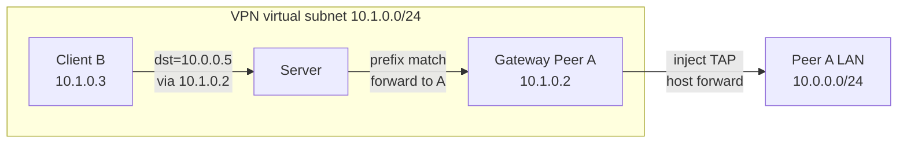

# Peer Prefix Routing (Site-to-Site Gateway) — Design Specification

> **Purpose:** Describe the current behavior, configuration, or implementation boundary for this topic.
> **Audience:** OPENPPP2 users, operators, and developers.
> **Status:** Current.
> **Last verified against:** Current repository structure, implementation paths, and documentation links, 2026-07-18.
> **Parent index:** [Back to index](README.md) · **Chinese:** [Peer 前缀路由（Site-to-Site 网关）设计说明](PEER_PREFIX_ROUTING_CN.md)


[中文版本](PEER_PREFIX_ROUTING_CN.md)

> **Status**: Implemented. Server prefix forwarding, client static/dynamic route installation, and gateway prefix announcement are all in place.
> **Code anchors**: `ppp/app/protocol/PeerPrefixRoute.h`, `VirtualEthernetSwitcher`, `VEthernetNetworkSwitcher`, `VEthernetExchanger`.

---

## 1. Background and Problem

### 1.1 Baseline Model

With `server.subnet = true`, OpenPPP2 forwards inter-peer traffic by **exact destination IP ownership**:

- Each client announces its **virtual TAP IP** via `PacketAction_LAN` after connect;
- The server records `virtual_ip → session` in `nats_`;
- Forwarding uses `FindNatInformation(destination)` to deliver to the owning peer.

This works for a **flat virtual subnet** (e.g. `10.1.0.2` pinging `10.1.0.3`) but does **not** support:

```
10.0.0.0/24 via 10.1.0.2   # reach a remote LAN through peer A as gateway
```

### 1.2 Target Scenarios

| Scenario | Description |
|----------|-------------|
| Site-to-Site | Expose site A's entire LAN `10.0.0.0/24` to the VPN via a gateway peer |
| Static policy | Operators pre-configure "prefix X egress via peer virtual IP Y" before connect |
| Dynamic discovery | When a gateway peer comes online, other clients learn routes automatically |

### 1.3 Design Goals

- Support **prefix → gateway peer virtual IP** routing semantics;
- Allow **static configuration** and **server-side dynamic distribution** together;
- Preserve legacy behavior when `peer-routing.enabled = false`;
- Stay orthogonal to P2P direct-path optimization; relay remains authoritative.

### 1.4 Non-Goals (Current Version)

- No IPv6 prefix gateway routing (IPv4 only);
- No complex policy routing DSL beyond prefix lists;
- Gateway peer does not perform SNAT on behalf of the host (`ip_forward` + host routing required);
- Full OS route installation on desktop Linux/Windows/macOS; Android/iOS support is limited.

---

## 2. Architecture Overview

### 2.1 Logical Topology



### 2.2 Three-Layer Split

| Layer | Responsibility |
|-------|----------------|
| **Client routing** | Install `10.0.0.0/24 via 10.1.0.2` on TAP so OS sends traffic into the tunnel |
| **Server relay** | Longest-prefix match; forward `dst=10.0.0.x` to gateway peer (not exact `nats_` lookup) |
| **Gateway host** | Receive NAT packet, inject into TAP, kernel forwards to physical LAN |

### 2.3 Relationship to Existing Modules

```
Phase 0 virtual subnet (LAN/NAT relay)
        │
        ▼
Peer prefix routing (this feature)
        │
        ├── static client.peer-routes
        ├── dynamic server.peer-routing.distribute
        └── gateway client.peer-route-announce
        │
        ▼ (orthogonal, optional)
P2P direct path (transport optimization only)
```

---

## 3. Data Plane Design

### 3.1 Egress (Client B → 10.0.0.5)

1. Application sends to `10.0.0.5`;
2. OS route: `10.0.0.0/24 via 10.1.0.2 dev tun0`;
3. IP packet `src=10.1.0.3, dst=10.0.0.5` enters TAP;
4. Client wraps as `PacketAction_NAT` to server;
5. Server `ForwardNatPacketToDestination()`:
   - `nats_[10.0.0.5]` miss;
   - `peer_prefix_rib_` LPM → `10.0.0.0/24 via 10.1.0.2`;
   - forward to exchanger owning `10.1.0.2`;
6. Gateway peer A `OnNat()` → `Output()` into TAP;
7. Host kernel forwards to LAN per `10.0.0.0/24 dev eth0`.

### 3.2 Server Forwarding Priority

```
1. Exact match nats_[dst]              → owner peer (legacy)
2. LPM on peer_prefix_rib_             → gateway peer virtual IP
3. No match                            → drop / no subnet forward
```

Prefix forwarding **skips** the gateway peer's own subnet mask check (because `dst` is outside the gateway TAP subnet).

### 3.3 Server Data Structures

| Structure | Key | Value |
|-----------|-----|-------|
| `peer_prefix_gateways_` | `session_id` | announced prefixes + gateway virtual IP |
| `peer_prefix_rib_` | prefix | `via` = gateway peer virtual IP (host order) |

On session disconnect, `DeletePeerPrefixGateway()` rebuilds the RIB and optionally broadcasts updates.

---

## 4. Control Plane Design

### 4.1 INFO Extension JSON

#### `peer-route-announce` (client → server)

```json
{
  "peer-route-announce": {
    "enabled": true,
    "action": "register",
    "prefixes": [
      { "network": "10.0.0.0", "prefix": 24 }
    ]
  }
}
```

| Field | Type | Description |
|-------|------|-------------|
| `enabled` | bool | Must be `true` |
| `action` | string | `"register"` |
| `prefixes[].network` | string | Network address |
| `prefixes[].prefix` | int | Prefix length 1–32 |

Server validates `server.peer-routing.enabled`, `server.subnet`, and that the session owns a virtual IP in `nats_`.

#### `peer-route-table` (server → client)

```json
{
  "peer-route-table": {
    "enabled": true,
    "action": "snapshot",
    "routes": [
      { "network": "10.0.0.0", "prefix": 24, "via": "10.1.0.2" }
    ]
  }
}
```

Pushed on handshake response and when the table changes (`distribute = true`).

---

## 5. Configuration Reference

### 5.1 Server

```json
{
  "server": {
    "subnet": true,
    "ipv4-pool": {
      "network": "10.1.0.0",
      "mask": "255.255.255.0"
    },
    "peer-routing": {
      "enabled": true,
      "distribute": true
    }
  }
}
```

| Key | Type | Default | Description |
|-----|------|---------|-------------|
| `server.subnet` | bool | `true` | **Required true** for subnet and prefix routing |
| `server.peer-routing.enabled` | bool | `false` | Enable server prefix table and forwarding |
| `server.peer-routing.distribute` | bool | `true` | Push `peer-route-table` snapshots to all clients |

### 5.2 Gateway Peer

```json
{
  "client": {
    "peer-route-announce": [
      { "network": "10.0.0.0", "prefix": 24 }
    ],
    "peer-gateway-forward": true
  }
}
```

| Key | Type | Default | Description |
|-----|------|---------|-------------|
| `client.peer-route-announce` | array | `[]` | Prefixes reachable via this gateway; **no `via` field** |
| `client.peer-gateway-forward` | bool | `false` | Marks gateway role (requires host `ip_forward`) |

Use a **fixed virtual IP** (manual assignment recommended):

```bash
--tun-ip=10.1.0.2 --tun-gw=10.1.0.1 --tun-mask=255.255.255.0
```

### 5.3 Access Client (Static Routes)

```json
{
  "client": {
    "peer-routes": [
      { "network": "10.0.0.0", "prefix": 24, "via": "10.1.0.2" }
    ]
  }
}
```

| Key | Type | Default | Description |
|-----|------|---------|-------------|
| `client.peer-routes` | array | `[]` | Static prefix routes; **`via` required** (gateway peer virtual IP) |

### 5.4 Static vs Dynamic

| | `client.peer-routes` | `peer-route-table` |
|--|----------------------|-------------------|
| Config location | Each access client | Server aggregate |
| Needs known peer IP | Yes | No |
| Use case | Fixed topology | Dynamic gateway join/leave |
| Can combine | Yes | Yes |

---

## 6. Full Configuration Example

### Three-node: one gateway + two access clients

**Plan:**

| Node | Role | VPN IP | Behind |
|------|------|--------|--------|
| Server | server | — | — |
| Site-A | gateway | `10.1.0.2` | `10.0.0.0/24` |
| Office-B | access | `10.1.0.3` | — |
| Office-C | access | `10.1.0.4` | — |

#### Server `server.json`

```json
{
  "mode": "server",
  "server": {
    "subnet": true,
    "ipv4-pool": { "network": "10.1.0.0", "mask": "255.255.255.0" },
    "peer-routing": { "enabled": true, "distribute": true }
  },
  "tcp": { "listen": { "port": 20000 } }
}
```

#### Gateway Site-A `site-a.json`

```json
{
  "mode": "client",
  "client": {
    "guid": "{11111111-1111-1111-1111-111111111111}",
    "server": "ppp://vpn.example.com:20000/",
    "peer-route-announce": [{ "network": "10.0.0.0", "prefix": 24 }],
    "peer-gateway-forward": true
  }
}
```

Host setup (Linux):

```bash
sysctl -w net.ipv4.ip_forward=1
```

#### Office-B (dynamic only)

```json
{
  "mode": "client",
  "client": {
    "guid": "{22222222-2222-2222-2222-222222222222}",
    "server": "ppp://vpn.example.com:20000/"
  }
}
```

#### Office-C (static + dynamic)

```json
{
  "mode": "client",
  "client": {
    "guid": "{33333333-3333-3333-3333-333333333333}",
    "server": "ppp://vpn.example.com:20000/",
    "peer-routes": [
      { "network": "10.0.0.0", "prefix": 24, "via": "10.1.0.2" }
    ]
  }
}
```

---

## 7. Deployment Checklist

### Server
- [ ] `server.subnet = true`
- [ ] `server.peer-routing.enabled = true`
- [ ] `server.ipv4-pool` configured

### Gateway peer
- [ ] `peer-route-announce` correct
- [ ] `peer-gateway-forward = true`
- [ ] Fixed virtual IP
- [ ] Host `ip_forward = 1`
- [ ] LAN return path via gateway

### Access client
- [ ] Routes visible: `ip route | grep 10.0.0.0`
- [ ] `ping 10.0.0.x` works

---

## 8. Troubleshooting

| Symptom | Likely cause | Fix |
|---------|--------------|-----|
| No route on client | `distribute=false` and no `peer-routes` | Enable distribute or add static routes |
| Route exists, ping fails | Gateway offline or wrong `via` | Verify gateway VIP |
| Packet reaches gateway, not LAN | `ip_forward` off | Enable forwarding |
| No return path | LAN has no route to VPN | SNAT or static routes on gateway |
| Server does not forward | `peer-routing` or `subnet` disabled | Check server config |

---

## 9. Compatibility

| Item | Notes |
|------|-------|
| `peer-routing.enabled=false` | Identical to pre-feature behavior |
| P2P | Prefix routing picks **which peer**; P2P optimizes **how** to reach it |
| `client.routes` | Split-tunnel (physical NIC vs VPN); different from `peer-routes` |

---

## 10. Implementation Index

| Component | File |
|-----------|------|
| Protocol structs | `ppp/app/protocol/PeerPrefixRoute.h` |
| JSON serde | `ppp/app/protocol/VirtualEthernetInformation.cpp` |
| Config parsing | `ppp/configurations/AppConfiguration.cpp` |
| Server prefix table | `ppp/app/server/VirtualEthernetSwitcher.cpp` |
| Server forward | `ppp/app/server/VirtualEthernetExchanger.cpp` |
| Client announce | `ppp/app/client/VEthernetExchanger.cpp` |
| Client route install | `ppp/app/client/VEthernetNetworkSwitcher.cpp` |

---

## 11. Related Docs

- [`ROUTING_AND_DNS.md`](ROUTING_AND_DNS.md)
- [`SERVER_IPV4_ASSIGNMENT_CN.md`](../archive/status/SERVER_IPV4_ASSIGNMENT_CN.md)
- [`P2P_NETWORKING_PLAN.md`](../archive/plans/P2P_NETWORKING_PLAN.md)
- [`CONFIGURATION.md`](../reference/CONFIGURATION.md)
