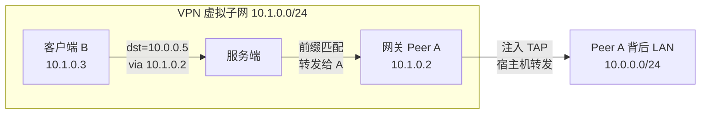
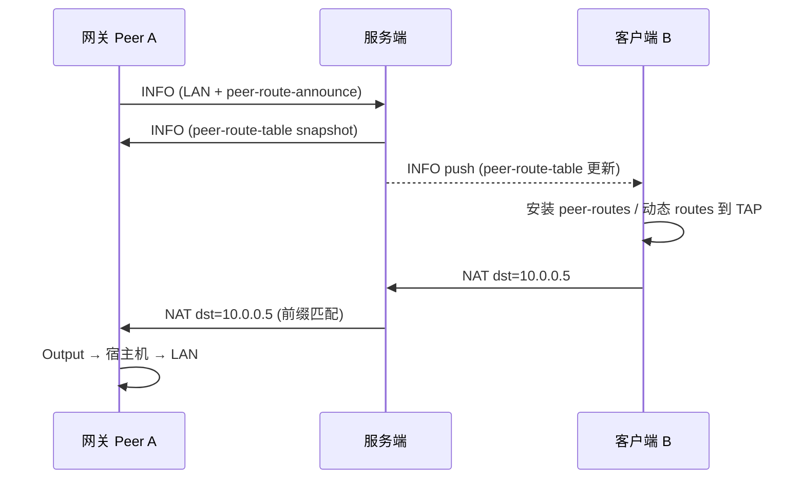

# Peer 前缀路由（Site-to-Site 网关）设计说明
> Status: Active
> Type: Guide
> Last verified: 63fc030

> **用途：**说明本主题的当前行为、配置或实现边界。
> **适用对象：**OPENPPP2 用户、运维人员与开发者。
> **当前状态：**当前有效。
> **最后核对依据：**当前仓库结构、实现路径与文档链接，2026-07-18。
> **上一层索引：**[返回索引](README_CN.md) · **English：**[Peer Prefix Routing (Site-to-Site Gateway) — Design Specification](PEER_PREFIX_ROUTING.md)


[English Version](PEER_PREFIX_ROUTING.md)

> **状态**：已实现。服务端前缀转发、客户端静态/动态路由安装、网关前缀宣告均已落地。
> **代码锚点**：`ppp/app/protocol/PeerPrefixRoute.h`、`VirtualEthernetSwitcher`、`VEthernetNetworkSwitcher`、`VEthernetExchanger`。

---

## 1. 背景与问题

### 1.1 原有模型

OpenPPP2 在 `server.subnet = true` 时，虚拟子网 peer 间转发遵循 **目的 IP 精确归属**：

- 每个客户端连接后通过 `PacketAction_LAN` 宣告自己的 **虚拟 TAP IP**；
- 服务端在 `nats_` 中记录 `虚拟IP → session`；
- 转发时查 `FindNatInformation(destination)`，将包交给拥有该 IP 的 peer。

该模型适合 **扁平虚拟子网内点对点互访**（如 `10.1.0.2` ping `10.1.0.3`），但不支持：

```
10.0.0.0/24 via 10.1.0.2   # 经 peer A 访问其背后整个 LAN
```

### 1.2 目标场景

| 场景 | 描述 |
|------|------|
| Site-to-Site | 站点 A 的整个内网 `10.0.0.0/24` 经网关 peer 暴露给 VPN |
| 静态策略 | 运维在连接前写好「某网段经某 peer 虚拟 IP 出」 |
| 动态发现 | 网关 peer 上线后，其他客户端自动学到路由，无需手改配置 |

### 1.3 设计目标

- 支持 **前缀 → 网关 peer 虚拟 IP** 的路由语义；
- **静态配置** 与 **服务端动态下发** 可同时启用；
- 不改变 `peer-routing.enabled = false` 时的既有行为；
- 与 P2P 直连优化正交，relay 路径始终可用。

### 1.4 非目标（当前版本）

- 不支持 IPv6 前缀网关路由（仅 IPv4）；
- 不支持一个 peer 宣告后与虚拟池冲突的复杂策略路由 DSL；
- 网关 peer 不代替宿主机做 SNAT（需宿主机 `ip_forward` + 自有路由/NAT）；
- Android/iOS 上 OS 路由安装能力有限，桌面 Linux/Windows/macOS 为完整支持平台。

---

## 2. 架构总览

### 2.1 逻辑拓扑



### 2.2 三层分工

| 层 | 职责 |
|----|------|
| **客户端路由层** | 在 TAP 上安装 `10.0.0.0/24 via 10.1.0.2`，让 OS 把流量送进隧道 |
| **服务端中继层** | 最长前缀匹配，将 `dst=10.0.0.x` 的包转给网关 peer（非精确 `nats_` 查找） |
| **网关宿主机层** | 收到 NAT 包后注入 TAP，由 Linux/Windows 内核转发到物理 LAN |

### 2.3 与现有模块关系

```
Phase 0 虚拟子网 (LAN/NAT relay)
        │
        ▼
Peer 前缀路由 (本功能)
        │
        ├── 静态 client.peer-routes
        ├── 动态 server.peer-routing.distribute
        └── 网关 client.peer-route-announce
        │
        ▼ (正交，可选)
P2P 直连优化 (仅改变传输路径，不改变路由语义)
```

---

## 3. 数据面设计

### 3.1 出站（客户端 B → 10.0.0.5）

1. 应用发起访问 `10.0.0.5`；
2. OS 路由表：`10.0.0.0/24 via 10.1.0.2 dev tun0`；
3. IP 包 `src=10.1.0.3, dst=10.0.0.5` 进入 TAP；
4. 客户端 `VEthernetNetworkSwitcher` 封装为 `PacketAction_NAT` 发往服务端；
5. 服务端 `ForwardNatPacketToDestination()`：
   - 先查 `nats_[10.0.0.5]` → 未命中；
   - 再查 `peer_prefix_rib_` 最长前缀 → `10.0.0.0/24 via 10.1.0.2`；
   - 将包转发给拥有 `10.1.0.2` 的 exchanger；
6. 网关 peer A 的 `OnNat()` → `Output()` 注入 TAP；
7. 宿主机内核根据 `10.0.0.0/24 dev eth0` 转发到 LAN 设备。

### 3.2 入站（10.0.0.5 → 客户端 B）

回程路径依赖网关 peer 宿主机路由与 VPN 子网回程路由，需保证：

- 网关 peer 知道 `10.1.0.0/24`（或更宽 VPN 前缀）经 `tun0` 出去；
- 背后 LAN 设备将 `10.1.0.3` 的回程指向网关 peer（或网关做 SNAT）。

### 3.3 服务端转发优先级

```
1. 精确匹配 nats_[dst]           → 转给 owner peer（原有逻辑）
2. 最长前缀匹配 peer_prefix_rib_ → 转给 gateway peer 虚拟 IP
3. 均未命中                     → 丢弃 / 不走子网转发
```

前缀转发时 **跳过** gateway peer 自身子网掩码校验（因 `dst` 不在 gateway 的 TAP 子网内）。

### 3.4 服务端数据结构

| 结构 | 键 | 值 |
|------|----|----|
| `peer_prefix_gateways_` | `session_id` | 宣告的前缀列表 + 网关虚拟 IP |
| `peer_prefix_rib_` | 前缀 | `via` = 网关 peer 虚拟 IP（主机序） |

会话断开时调用 `DeletePeerPrefixGateway()`，重建 RIB 并可选广播更新。

---

## 4. 控制面设计

### 4.1 INFO 扩展 JSON

控制消息走现有 `INFO` 信封扩展，不新增 link-layer action。

#### 4.1.1 `peer-route-announce`（客户端 → 服务端）

网关 peer 连接时注册可达前缀：

```json
{
  "peer-route-announce": {
    "enabled": true,
    "action": "register",
    "prefixes": [
      { "network": "10.0.0.0", "prefix": 24 },
      { "network": "192.168.50.0", "prefix": 24 }
    ]
  }
}
```

| 字段 | 类型 | 说明 |
|------|------|------|
| `enabled` | bool | 必须为 `true` 才处理 |
| `action` | string | 固定 `"register"` |
| `prefixes` | array | 该 peer 可达的 IPv4 前缀列表 |
| `prefixes[].network` | string | 网络地址，如 `"10.0.0.0"` |
| `prefixes[].prefix` | int | 前缀长度，1–32 |

服务端校验：

- `server.peer-routing.enabled = true` 且 `server.subnet = true`；
- 宣告方 session 已在 `nats_` 中拥有虚拟 IP（须先完成 LAN 宣告）；
- 成功后 `action` 回 `"registered"`，失败为 `"reject"`。

#### 4.1.2 `peer-route-table`（服务端 → 客户端）

路由快照，供客户端安装 OS/TAP 路由：

```json
{
  "peer-route-table": {
    "enabled": true,
    "action": "snapshot",
    "routes": [
      { "network": "10.0.0.0", "prefix": 24, "via": "10.1.0.2" },
      { "network": "192.168.50.0", "prefix": 24, "via": "10.1.0.4" }
    ]
  }
}
```

| 字段 | 类型 | 说明 |
|------|------|------|
| `enabled` | bool | 快照有效标志 |
| `action` | string | 固定 `"snapshot"` |
| `routes` | array | 当前全局前缀路由表 |
| `routes[].via` | string | 网关 peer 的 **虚拟 IP** |

下发时机：

- 客户端握手 INFO 响应（`BuildInformationEnvelope`）；
- 任一网关 peer 注册/更新/断开前缀（`distribute = true` 时广播）。

### 4.2 握手时序



---

## 5. 配置参考

### 5.1 服务端

```json
{
  "server": {
    "subnet": true,
    "ipv4-pool": {
      "network": "10.1.0.0",
      "mask": "255.255.255.0"
    },
    "peer-routing": {
      "enabled": true,
      "distribute": true
    }
  }
}
```

| 键 | 类型 | 默认 | 说明 |
|----|------|------|------|
| `server.subnet` | bool | `true` | **必须为 true**，否则子网转发与前缀路由均不工作 |
| `server.peer-routing.enabled` | bool | `false` | 启用服务端前缀表与转发 |
| `server.peer-routing.distribute` | bool | `true` | 前缀表变化时向所有已连接客户端推送 `peer-route-table` |

**依赖关系：**

```
server.peer-routing.enabled  ⇒  server.subnet = true
```

### 5.2 客户端 — 网关 peer（宣告前缀）

```json
{
  "client": {
    "guid": "{GATEWAY-A-GUID}",
    "server": "ppp://vpn.example.com:20000/",
    "peer-route-announce": [
      { "network": "10.0.0.0", "prefix": 24 }
    ],
    "peer-gateway-forward": true
  }
}
```

| 键 | 类型 | 默认 | 说明 |
|----|------|------|------|
| `client.peer-route-announce` | array | `[]` | 本节点作为网关时宣告的可达前缀；**不含 `via`** |
| `client.peer-gateway-forward` | bool | `false` | 标记本节点为网关角色（配合宿主机 `ip_forward`） |

建议使用 **固定虚拟 IP**（手动分配或预留），便于其他节点静态引用：

```bash
--tun-ip=10.1.0.2 --tun-gw=10.1.0.1 --tun-mask=255.255.255.0
```

### 5.3 客户端 — 访问方（静态路由）

```json
{
  "client": {
    "guid": "{CLIENT-B-GUID}",
    "server": "ppp://vpn.example.com:20000/",
    "peer-routes": [
      { "network": "10.0.0.0", "prefix": 24, "via": "10.1.0.2" }
    ]
  }
}
```

| 键 | 类型 | 默认 | 说明 |
|----|------|------|------|
| `client.peer-routes` | array | `[]` | 静态前缀路由；**必须包含 `via`**（网关 peer 虚拟 IP） |
| `peer-routes[].network` | string | — | 目标前缀网络地址 |
| `peer-routes[].prefix` | int | — | 前缀长度 1–32 |
| `peer-routes[].via` | string | — | 下一跳：网关 peer 在 VPN 内的虚拟 IPv4 |

静态路由在隧道建立后写入 RIB 与 OS 路由表，**不依赖**网关 peer 是否已在线（但流量在网关离线时会失败）。

### 5.4 静态 vs 动态

| 对比项 | `client.peer-routes`（静态） | `peer-route-table`（动态） |
|--------|------------------------------|----------------------------|
| 配置位置 | 各访问方客户端 JSON | 服务端汇聚后下发 |
| 生效时机 | 本机连接后即可安装 | 网关 peer 注册前缀后 |
| 是否需预知 peer IP | 是（`via` 要写死） | 否（服务端填 `via`） |
| 适用场景 | 固定拓扑、IP 规划明确 | 网关动态上下线、多站点自动发现 |
| 可同时使用 | 是；两者合并安装，动态项可覆盖同前缀静态项 |

推荐生产组合：

```
server.peer-routing.enabled = true
server.peer-routing.distribute = true
网关 peer：peer-route-announce
访问方：仅依赖动态下发；或静态 + 动态双保险
```

---

## 6. 完整配置示例

### 6.1 三节点：一个网关 + 两个访问方

**网络规划：**

| 节点 | 角色 | VPN 虚拟 IP | 背后网段 |
|------|------|-------------|----------|
| Server | 服务端 | — | — |
| Site-A | 网关 | `10.1.0.2` | `10.0.0.0/24` |
| Office-B | 访问方 | `10.1.0.3` | — |
| Office-C | 访问方 | `10.1.0.4` | — |

#### 服务端 `server.json`

```json
{
  "mode": "server",
  "server": {
    "subnet": true,
    "ipv4-pool": {
      "network": "10.1.0.0",
      "mask": "255.255.255.0"
    },
    "peer-routing": {
      "enabled": true,
      "distribute": true
    }
  },
  "tcp": {
    "listen": { "port": 20000 }
  }
}
```

#### 网关 Site-A `site-a.json`

```json
{
  "mode": "client",
  "client": {
    "guid": "{11111111-1111-1111-1111-111111111111}",
    "server": "ppp://vpn.example.com:20000/",
    "peer-route-announce": [
      { "network": "10.0.0.0", "prefix": 24 }
    ],
    "peer-gateway-forward": true
  }
}
```

启动时指定固定虚拟 IP：

```bash
./ppp --mode=client -c site-a.json \
  --tun-ip=10.1.0.2 --tun-gw=10.1.0.1 --tun-mask=255.255.255.0
```

Site-A 宿主机（Linux 示例）：

```bash
sysctl -w net.ipv4.ip_forward=1
ip route add 10.0.0.0/24 dev eth0    # 若已有直连网段可省略
```

#### 访问方 Office-B（纯动态，不写 peer-routes）

```json
{
  "mode": "client",
  "client": {
    "guid": "{22222222-2222-2222-2222-222222222222}",
    "server": "ppp://vpn.example.com:20000/"
  }
}
```

连接后服务端推送 `peer-route-table`，自动安装 `10.0.0.0/24 via 10.1.0.2`。

#### 访问方 Office-C（静态 + 动态）

```json
{
  "mode": "client",
  "client": {
    "guid": "{33333333-3333-3333-3333-333333333333}",
    "server": "ppp://vpn.example.com:20000/",
    "peer-routes": [
      { "network": "10.0.0.0", "prefix": 24, "via": "10.1.0.2" }
    ]
  }
}
```

### 6.2 多站点网关

```json
{
  "client": {
    "peer-route-announce": [
      { "network": "10.0.0.0", "prefix": 24 },
      { "network": "172.16.10.0", "prefix": 24 }
    ],
    "peer-gateway-forward": true
  }
}
```

服务端汇聚后下发：

```json
{
  "peer-route-table": {
    "routes": [
      { "network": "10.0.0.0", "prefix": 24, "via": "10.1.0.2" },
      { "network": "172.16.10.0", "prefix": 24, "via": "10.1.0.5" }
    ]
  }
}
```

### 6.3 关闭动态分发（仅服务端转发 + 客户端静态）

```json
{
  "server": {
    "peer-routing": {
      "enabled": true,
      "distribute": false
    }
  }
}
```

此时服务端仍做前缀 → 网关转发，但 **不推送** `peer-route-table`；访问方必须自行配置 `client.peer-routes`。

---

## 7. 部署检查清单

### 7.1 服务端

- [ ] `server.subnet = true`
- [ ] `server.peer-routing.enabled = true`
- [ ] `server.ipv4-pool` 已配置且与虚拟 IP 规划一致

### 7.2 网关 peer

- [ ] `peer-route-announce` 包含正确前缀
- [ ] `peer-gateway-forward = true`
- [ ] 虚拟 IP 固定（推荐手动 `--tun-ip`）
- [ ] 宿主机 `ip_forward = 1`
- [ ] 宿主机到背后 LAN 的路由正确
- [ ] 背后 LAN 回程指向网关 peer（或网关 SNAT）

### 7.3 访问方客户端

- [ ] 动态模式：等待 `peer-route-table` 或检查日志 `peer prefix routes applied`
- [ ] 静态模式：`via` 与网关虚拟 IP 一致
- [ ] `ip route` / `route print` 可见 `10.0.0.0/24 via 10.1.0.2`

### 7.4 验证命令

```bash
# 访问方
ip route show | grep 10.0.0.0
ping -c 3 10.0.0.5

# 网关 peer
sysctl net.ipv4.ip_forward
tcpdump -i tun0 host 10.0.0.5
```

---

## 8. 故障排查

| 现象 | 可能原因 | 处理 |
|------|----------|------|
| 访问方无 `10.0.0.0/24` 路由 | `distribute=false` 且未配 `peer-routes` | 开启动态或补静态配置 |
| 路由存在但 ping 不通 | 网关 peer 未上线或虚拟 IP 错误 | 确认 `via` 与网关实际 VIP 一致 |
| 包到网关但不到 LAN | 宿主机未开 `ip_forward` | `sysctl -w net.ipv4.ip_forward=1` |
| 回程不通 | LAN 设备无到 VPN 前缀的路由 | 在网关做 SNAT 或补静态路由 |
| 服务端不转发 | `peer-routing.enabled=false` 或 `subnet=false` | 检查服务端配置 |
| 宣告失败 `reject` | 网关未完成 LAN 注册就发 announce | 确认握手顺序与虚拟 IP 已分配 |

---

## 9. 兼容性

| 项目 | 说明 |
|------|------|
| `peer-routing.enabled=false` | 与升级前行为一致 |
| P2P | 前缀路由决定 **走哪个 peer**；P2P 仅优化到该 peer 的传输路径 |
| `client.routes` | 分流路由（物理网卡 vs 隧道），与 `peer-routes` 不同层 |
| 前缀冲突 | 后注册会话覆盖同前缀（会话断开时清除） |

---

## 10. 实现索引

| 组件 | 文件 |
|------|------|
| 协议结构 | `ppp/app/protocol/PeerPrefixRoute.h` |
| JSON 序列化 | `ppp/app/protocol/VirtualEthernetInformation.cpp` |
| 配置解析 | `ppp/configurations/AppConfiguration.cpp` |
| 服务端前缀表 | `ppp/app/server/VirtualEthernetSwitcher.cpp` |
| 服务端转发 | `ppp/app/server/VirtualEthernetExchanger.cpp` → `ForwardNatPacketToDestination` |
| 客户端宣告 | `ppp/app/client/VEthernetExchanger.cpp` |
| 客户端路由安装 | `ppp/app/client/VEthernetNetworkSwitcher.cpp` → `ApplyPeerPrefixRoutes` |

---

## 11. 相关文档

- [`ROUTING_AND_DNS_CN.md`](ROUTING_AND_DNS_CN.md) — 客户端分流路由与 DNS
- [`SERVER_IPV4_ASSIGNMENT_CN.md`](../archive/status/SERVER_IPV4_ASSIGNMENT_CN.md) — 虚拟 IP 自动/手动分配
- [`P2P_NETWORKING_PLAN.md`](../archive/plans/P2P_NETWORKING_PLAN.md) — P2P 直连（与前缀路由正交）
- [`CONFIGURATION_CN.md`](../reference/CONFIGURATION_CN.md) — 全局配置索引
