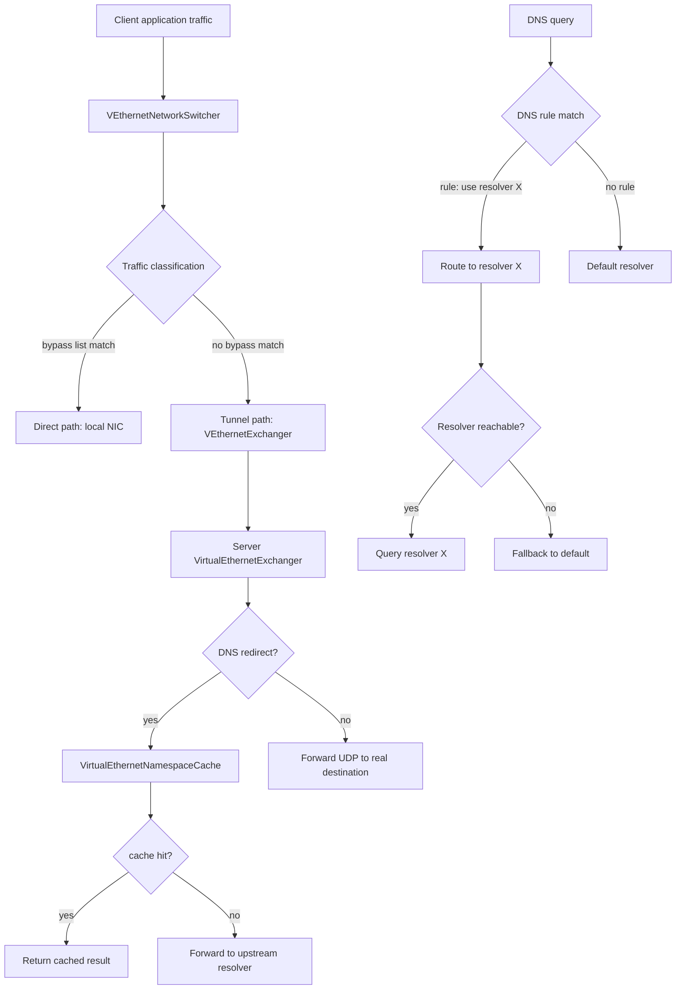
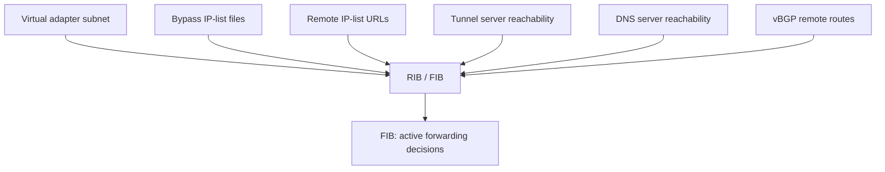
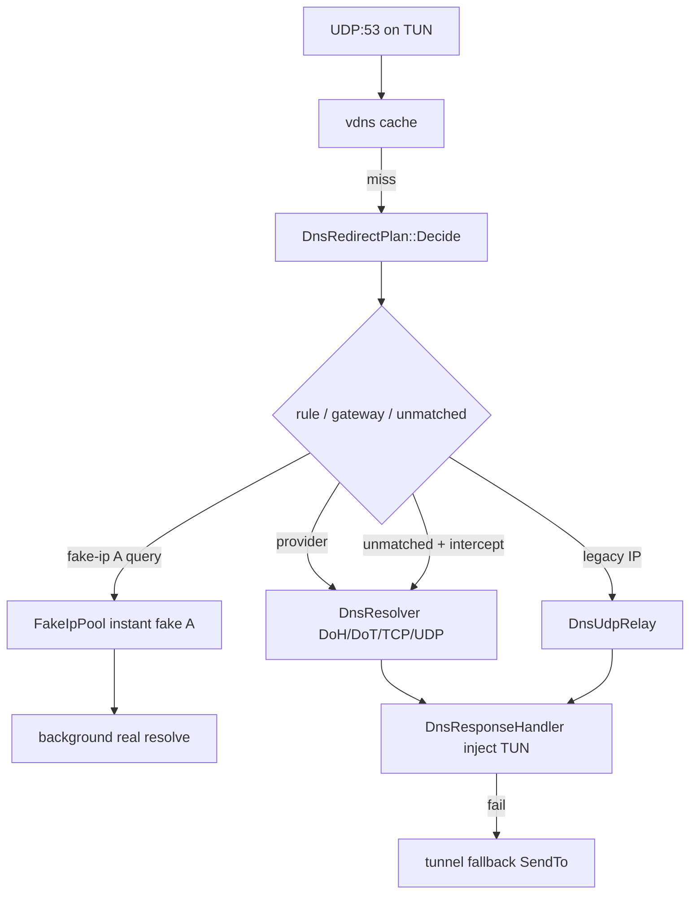
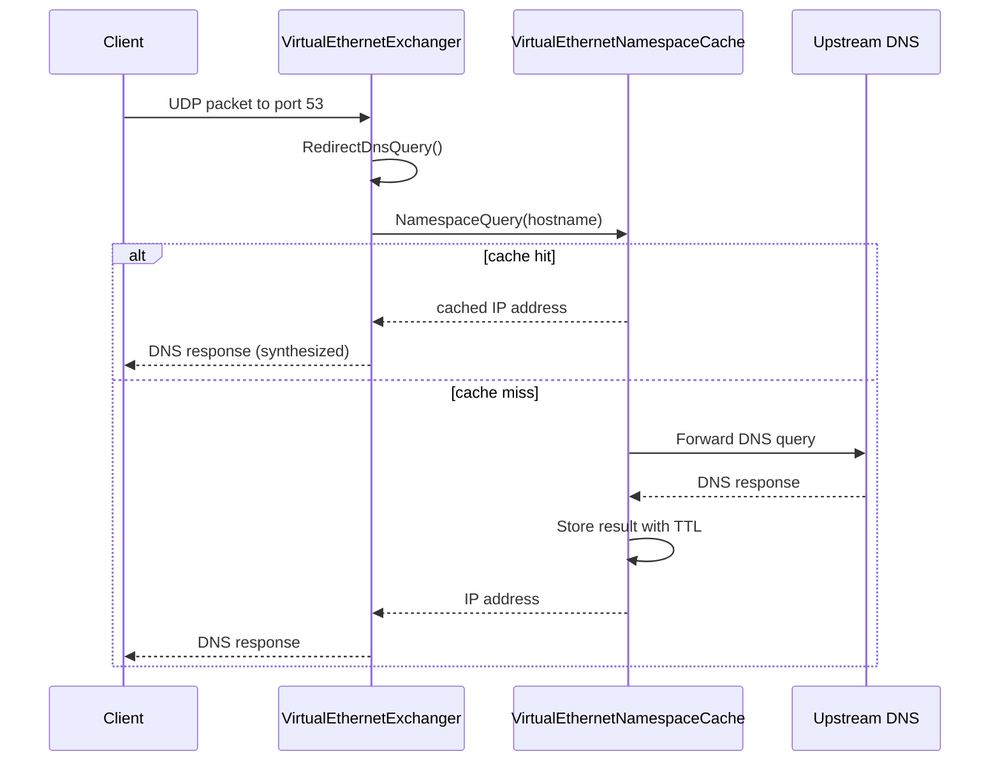
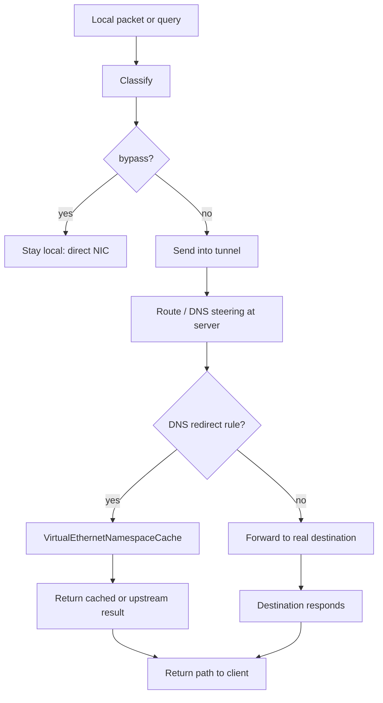

# Routing And DNS

> **Purpose:** Describe the current behavior, configuration, or implementation boundary for this topic.
> **Audience:** OPENPPP2 users, operators, and developers.
> **Status:** Current.
> **Last verified against:** Current repository structure, implementation paths, and main verification record, 2026-07-18.
> **Parent index:** [Back to index](README.md) · **Chinese:** [路由与 DNS](ROUTING_AND_DNS_CN.md)

> Status: Active
> Type: Reference
> Last verified: c993753

[中文版本](ROUTING_AND_DNS_CN.md)

## Scope

This document explains the real routing and DNS steering model used by OPENPPP2.
In the code, these are not separate concerns. They form one traffic-classification system on the client,
with continued DNS handling on the server.

Main anchors:

- `ppp/app/client/VEthernetNetworkSwitcher.*`
- `ppp/app/client/route/RouteState.*`
- `ppp/app/client/route/RouteCoordinator.*`
- `ppp/app/client/route/RoutePlanInput.h`
- `ppp/app/client/dns/DnsController.*`
- `ppp/app/client/dns/Rule.*`
- `ppp/app/server/VirtualEthernetExchanger.*`
- `ppp/app/server/VirtualEthernetDatagramPort.*`
- `ppp/app/server/VirtualEthernetNamespaceCache.*`

---

## Architecture Overview



---

## Core Idea

The client decides what goes local, what goes to the tunnel, and which DNS servers must remain reachable.

The server continues the DNS path by:
- answering from cache (fast path)
- redirecting to a configured upstream resolver
- forwarding normally when no special rule applies

---

## Client-Side Ownership

`VEthernetNetworkSwitcher` composes route and DNS services but does not own their domain state. `route::RouteState` owns route data, and `dns::DnsController` owns query/session lifetime.

Before an operation, the Switcher copies TAP facts, interface snapshots, configuration flags, bypass entries, DNS
reachability, and fake-IP routing into a `RoutePlanInput`. Route managers and platform adapters receive that value
as `const` input and do not retain a Switcher pointer. The default-route protection worker captures only its plan
and an independently owned cancellation state.

### Route Information Base

| Field | Description |
|-------|-------------|
| `RouteState::rib` | Route information base — all known routes |
| `RouteState::fib` | Forwarding information base — active lookup table |
| `ribs_` | Loaded IP-list sources (files, URLs) |
| `vbgp_` | Remote route sources (vBGP) |

### DNS State

| Field / object | Description |
|----------------|-------------|
| `DnsController` | Query context, session generation, and close ordering |
| `DnsInterceptor` | Controller-owned DNS policy, resolver, rules, and fake-ip pool |
| `RouteState::dns_servers` | Value snapshots of tunnel/NIC DNS reachability routes |

Packet dispatch calls `DnsController::HandleQuery()` with an immutable session snapshot. The controller delegates policy to `DnsInterceptor`; tunnel fallback uses `IDnsTunnelTransport` rather than a concrete exchanger. See [DNS_MODULE_DESIGN.md](../architecture/DNS_MODULE_DESIGN.md).

`DnsController` is the only production entry point for rule loading, negotiated session information, fake-IP
rewrite, fake-IP route projection, and resolver reachability. The Switcher no longer stores a second interceptor.

### Transaction and teardown

`RouteCoordinator` captures platform defaults, removes conflicting defaults, applies `RouteSpec` values, and records successful operations. Partial failure deletes applied routes in reverse order and restores the platform-private snapshot. `Stop()` is idempotent.

Teardown closes `DnsController` first, disposes the exchanger second, and rolls back routes last. This prevents late DNS callbacks from using a dead transport while preserving DNS route snapshots until removal.

---

## Route Construction

The client builds routes from multiple sources:



### Key Methods

```cpp
/**
 * @brief Add all routes from all configured sources.
 * @param y  Yield context for async IP-list loading.
 * @return   true if all routes were applied successfully.
 */
bool AddAllRoute(YieldContext& y) noexcept;

/**
 * @brief Load and add routes from an IP-list source.
 * @param path_or_url  File path or HTTP/HTTPS URL of IP-list.
 * @return             Number of routes added.
 */
int AddLoadIPList(const ppp::string& path_or_url) noexcept;

/**
 * @brief Load IP-list from multiple file paths.
 * @param paths  Vector of file paths.
 * @return       Total routes loaded.
 */
int LoadAllIPListWithFilePaths(const ppp::vector<ppp::string>& paths) noexcept;

/**
 * @brief Add a reachability route for a remote endpoint.
 * @param endpoint  The remote endpoint (server or DNS server).
 * @return          true if route was added.
 */
bool AddRemoteEndPointToIPList(const IPEndPoint& endpoint) noexcept;

/**
 * @brief Add a route entry to the OS routing table.
 * @param network    Network address.
 * @param mask       Subnet mask.
 * @param gateway    Gateway address.
 * @return           true on success.
 */
bool AddRoute(UInt32 network, UInt32 mask, UInt32 gateway) noexcept;

/**
 * @brief Protect the default route from being overwritten by the tunnel.
 * @return true if default route was successfully protected.
 */
bool ProtectDefaultRoute() noexcept;
```

Source: `ppp/app/client/VEthernetNetworkSwitcher.h`

---

## DNS Rules

Client DNS rules decide which resolver to use for a domain or domain pattern. The full intercepted pipeline is documented in [DNS_MODULE_DESIGN.md](../architecture/DNS_MODULE_DESIGN.md).

### Rule Matching



### DNS Rule Format

```json
"dns-rules": [
  "rules://path/to/dns-rules.txt"
]
```

The rules file format uses domain suffix / wildcard entries, each mapped to a resolver address.

Source: `ppp/app/client/dns/Rule.h`

---

## DNS Server Route Assignment

DNS servers are treated as reachability-sensitive endpoints.

When the client configures a DNS server:
1. A direct route to the DNS server is added via the physical NIC (not through the tunnel).
2. This ensures DNS queries to this server always reach it, regardless of default route changes.

```cpp
/**
 * @brief Add routes to make DNS servers reachable directly.
 * @return true if all DNS server routes were added.
 */
bool AddRouteWithDnsServers() noexcept;

/**
 * @brief Remove DNS server reachability routes.
 * @return true if routes were removed.
 */
bool DeleteRouteWithDnsServers() noexcept;
```

---

## Server-Side DNS Path

On the server side, DNS handling flows through:



### Server DNS API

```cpp
/**
 * @brief Redirect a DNS query through the namespace cache.
 * @param y          Yield context.
 * @param src        Source endpoint (client).
 * @param dns_data   Raw DNS query packet.
 * @param length     Length of DNS packet.
 * @return           true if query was handled.
 */
bool RedirectDnsQuery(YieldContext& y,
                      const IPEndPoint& src,
                      const Byte* dns_data,
                      int length) noexcept;
```

Source: `ppp/app/server/VirtualEthernetExchanger.h`

### Namespace Cache

`VirtualEthernetNamespaceCache` maintains a TTL-based DNS cache:

```cpp
/**
 * @brief Query the namespace cache for a hostname.
 * @param y         Yield context.
 * @param hostname  The hostname to resolve.
 * @return          Resolved IP address, or IPEndPoint::None on failure.
 */
IPEndPoint Query(YieldContext& y, const ppp::string& hostname) noexcept;

/**
 * @brief Insert a resolved entry into the cache.
 * @param hostname  The resolved hostname.
 * @param address   The IP address result.
 * @param ttl       Time-to-live in seconds.
 */
void Insert(const ppp::string& hostname, const IPEndPoint& address, int ttl) noexcept;
```

Source: `ppp/app/server/VirtualEthernetNamespaceCache.h`

---

## Path Model



---

## IP-List Sources

OPENPPP2 supports loading IP bypass lists from multiple sources:

| Source type | Example | Description |
|-------------|---------|-------------|
| Local file | `/etc/openppp2/bypass.txt` | Plain text file, one CIDR per line |
| HTTP URL | `http://example.com/bypass.txt` | Fetched on startup |
| HTTPS URL | `https://cdn.example.com/bypass.txt` | TLS-fetched on startup |
| VIRR refresh | Configured `virr.update-interval` | Periodic automatic refresh |

### VIRR Configuration

```json
"virr": {
    "update-interval": 86400,
    "url": "https://example.com/bypass-list.txt"
}
```

When the bypass list is refreshed, the routing table is updated accordingly.

---

## vBGP Remote Routes

The vBGP subsystem allows loading route information from a remote BGP-style source:

```json
"vbgp": {
    "update-interval": 3600,
    "url": "https://example.com/bgp-routes.txt"
}
```

Routes from vBGP are merged into the client RIB.

---

## Operational Meaning

Routing and DNS are not separate knobs. They form a unified traffic classification policy:

| Concern | How it connects |
|---------|----------------|
| Bypass list | Determines which destinations skip the tunnel |
| DNS rules | Determines which resolver is used per domain |
| Resolver reachability | Resolver routes keep resolvers reachable even when default route is redirected |
| Server DNS cache | Reduces repeated upstream DNS lookups |
| IPv6 transit | Can alter what "reachable" means for IPv6 destinations |
| Static echo | Can provide a separate path that bypasses DNS decisions |

---

## Configuration Reference

| Config key | Default | Description |
|------------|---------|-------------|
| `client.dns-rules` | `[]` | DNS rules file paths or URLs |
| `client.bypass` | `[]` | IP bypass list file paths or URLs |
| `geo-rules.enabled` | `false` | Generate extra bypass and DNS-rule files from local text GeoIP/GeoSite inputs |
| `geo-rules.geoip-dat` | `GeoIP.dat` | Local cache path for GeoIP dat; downloaded and parsed for the configured country |
| `geo-rules.geosite-dat` | `GeoSite.dat` | Local cache path for GeoSite dat; downloaded and parsed for the configured country |
| `geo-rules.geoip-download-url` | `""` | Optional HTTP/HTTPS URL used to download/update `geoip-dat` |
| `geo-rules.geosite-download-url` | `""` | Optional HTTP/HTTPS URL used to download/update `geosite-dat` |
| `geo-rules.geoip` | `[]` | Local text CIDR source file path or array of paths |
| `geo-rules.geosite` | `[]` | Local text domain source file path or array of paths |
| `geo-rules.append-bypass` | `[]` | Extra inline CIDRs or local CIDR files appended after generated GeoIP CIDRs |
| `geo-rules.append-dns-rules` | `[]` | Extra inline DNS rules/domains or `rules://` local files appended after generated GeoSite rules |
| `virr.update-interval` | `86400` | Bypass list refresh interval (seconds) |
| `virr.url` | `""` | Bypass list URL for periodic refresh |
| `vbgp.update-interval` | `3600` | vBGP route refresh interval (seconds) |
| `vbgp.url` | `""` | vBGP route source URL |
| `udp.dns.cache` | `true` | Enables DNS cache writes; `false` or `udp.dns.ttl=0` disables writes and server namespace cache creation |
| `udp.dns.ttl` | `60` | Maximum DNS cache TTL in seconds; positive response TTLs are honored and capped by this value |
| `dns.servers.domestic` | `doh.pub` | Default domestic provider or structured DNS server spec |
| `dns.servers.foreign` | `cloudflare` | Default foreign provider or structured DNS server spec |
| `dns.intercept-unmatched` | `true` | Intercept unmatched DNS queries and resolve through `foreign -> domestic -> cloudflare` |
| `dns.fake-ip.enabled` | `false` | Clash-style fake-ip (instant fake A, background real resolve) |
| `dns.fake-ip.range` | `198.18.0.1/16` | Fake-ip pool CIDR |

---

## Error Code Reference

Routing and DNS `ppp::diagnostics::ErrorCode` values (from `ppp/diagnostics/ErrorCodes.def`):

| ErrorCode | Description |
|-----------|-------------|
| `RouteAddFailed` | Failed to add a route to the OS routing table |
| `RouteDeleteFailed` | Failed to remove a route |
| `RouteReplaceFailed` | Failed to replace an existing route |
| `ConfigDnsRuleLoadFailed` | Failed to load DNS rules from configured source |
| `ConfigRouteLoadFailed` | Failed to load route list from configured source |
| `DnsResolveFailed` | DNS resolution failed |
| `DnsAddressInvalid` | DNS address is invalid |

---

## Usage Examples

### Configuring a split-tunnel bypass list

```json
{
  "client": {
    "bypass": [
      "/etc/openppp2/china-cidr.txt",
      "https://raw.githubusercontent.com/user/repo/main/bypass.txt"
    ]
  }
}
```

### Configuring domain-based DNS rules

```json
{
  "client": {
    "dns-rules": [
      "rules:///etc/openppp2/dns-rules.txt"
    ]
  }
}
```

DNS rules file format example:

```
# Provider rules (preferred)
example.cn /doh.pub/nic
google.com /cloudflare/tun

# Legacy IP rules remain supported
legacy-cn.example /1.2.4.8/nic
legacy-foreign.example /1.1.1.1/tun
```

For provider rules, the third segment selects resolver semantics: `/nic` means domestic and ECS-eligible; `/tun`, `/vpn`, `/cf`, and `/c` mean foreign and no ECS. For legacy IP rules, the same segment keeps its path meaning: `/nic` bypasses the VPN through the physical adapter, while `/tun` forwards through the tunnel.

### Generating GeoIP / GeoSite split rules

`geo-rules` is optional and disabled by default. When enabled, OPENPPP2 downloads/parses GeoIP/GeoSite dat files when configured, reads local text GeoIP/GeoSite inputs, writes generated bypass and DNS-rule files, and then connects those files to the existing route/DNS loading paths. `client.dns-rules` / `--dns-rules` are still loaded normally. For bypass, `client.bypass` / `--bypass` is folded into the generated `output-bypass` file and de-duplicated with GeoIP/dat/text/append-bypass entries, rather than being registered as a second independent bypass list.

```json
{
  "geo-rules": {
    "enabled": true,
    "country": "cn",
    "geoip-dat": "/var/lib/openppp2/GeoIP.dat",
    "geosite-dat": "/var/lib/openppp2/GeoSite.dat",
    "geoip-download-url": "https://testingcf.jsdelivr.net/gh/MetaCubeX/meta-rules-dat@release/geoip.dat",
    "geosite-download-url": "https://testingcf.jsdelivr.net/gh/MetaCubeX/meta-rules-dat@release/geosite.dat",
    "geoip": [
      "/etc/openppp2/geoip-cn.txt"
    ],
    "geosite": [
      "/etc/openppp2/geosite-cn.txt"
    ],
    "dns-provider-domestic": "doh.pub",
    "dns-provider-foreign": "cloudflare",
    "output-bypass": "/var/lib/openppp2/generated/bypass-cn.txt",
    "output-dns-rules": "/var/lib/openppp2/generated/dns-rules-cn.txt",
    "append-bypass": [
      "10.0.0.0/8",
      "/etc/openppp2/custom-bypass.txt"
    ],
    "append-dns-rules": [
      "example.cn /doh.pub/nic",
      "internal.example.cn",
      "rules:///etc/openppp2/custom-dns-rules.txt"
    ]
  },
  "dns": {
    "servers": {
      "domestic": "doh.pub",
      "foreign": "cloudflare"
    }
  }
}
```

Supported input formats are intentionally simple:

```text
# geoip-cn.txt: one CIDR per line
1.0.1.0/24
1.0.2.0/23
2408:8000::/20
```

```text
# geosite-cn.txt: one domain or matcher per line
baidu.com
.qq.com
domain:taobao.com
suffix:jd.com
full:example.cn
regexp:^.*\.example\.cn$
```

Important details:

- `geoip-download-url` and `geosite-download-url` download dat files into `geoip-dat` and `geosite-dat` at startup.
- Downloaded binary `geoip.dat` / `geosite.dat` files are parsed automatically for `geo-rules.country`; local text `geoip` / `geosite` inputs and append lists are merged afterwards.
- When `geo-rules.enabled=true`, command-line/config bypass sources (`--bypass` / `client.bypass`) are read into `output-bypass` and de-duplicated with generated GeoIP CIDRs. When `geo-rules.enabled=false`, the old direct bypass registration behavior is unchanged.
- The parser also accepts snake_case compatibility keys (`geoip_dat`, `geosite_dat`, `geoip_download_url`, `geosite_download_url`), but kebab-case is the documented form.
- `geoip` and `geosite` still support local text files only; use `geoip-download-url` / `geosite-download-url` for dat downloads.
- Generated DNS rules use `/<dns-provider-domestic>/nic`; if unset, the provider falls back to `dns.servers.domestic`, then `doh.pub`.
- `dns-provider-foreign` is parsed and reserved for future non-CN or `geolocation-!cn` generation, but is not consumed by the current generator.
- `append-bypass` is merged after GeoIP CIDRs and can contain inline CIDRs or local CIDR files.
- `append-dns-rules` is merged after GeoSite rules and can contain full rules, plain domains normalized with the domestic provider, or `rules://` local files.
- Client `vdns` and server namespace cache store only positive A/AAAA/CNAME-chain responses with positive TTL; cached TTL is `min(response TTL, udp.dns.ttl)`, and `udp.dns.cache=false` or `udp.dns.ttl=0` disables writes.
- Android/iOS clients currently do not run the generator, so existing mobile DNS-rule injection paths remain unchanged.

### Checking if a bypass route is active (code)

```cpp
// ppp/app/client/VEthernetNetworkSwitcher.cpp
bool VEthernetNetworkSwitcher::IsRoutedThroughTunnel(UInt32 dest_ip) noexcept {
    auto it = fib_.find(dest_ip & mask_);
    if (it != fib_.end()) {
        return false;  // bypass hit: use local NIC
    }
    return true;  // no bypass: use tunnel
}
```

---

## What To Watch For In Code

- Route entries are not just static tables; they are built from host, tunnel, and bypass inputs.
- DNS servers are treated like reachability-sensitive endpoints — they get their own route entries.
- Server-side DNS behavior depends on namespace cache and datagram port state.
- IPv6 transit and static echo can alter what "reachable" means for specific destinations.
- The bypass list and DNS rules are refreshed independently; both should be consistent.

---

## Related Documents

- [`CONFIGURATION.md`](../reference/CONFIGURATION.md)
- [`CLIENT_ARCHITECTURE.md`](../architecture/CLIENT_ARCHITECTURE.md)
- [`SERVER_ARCHITECTURE.md`](../architecture/SERVER_ARCHITECTURE.md)
- [`LINKLAYER_PROTOCOL.md`](../reference/LINKLAYER_PROTOCOL.md)
- [`DEPLOYMENT.md`](../operations/DEPLOYMENT.md)
